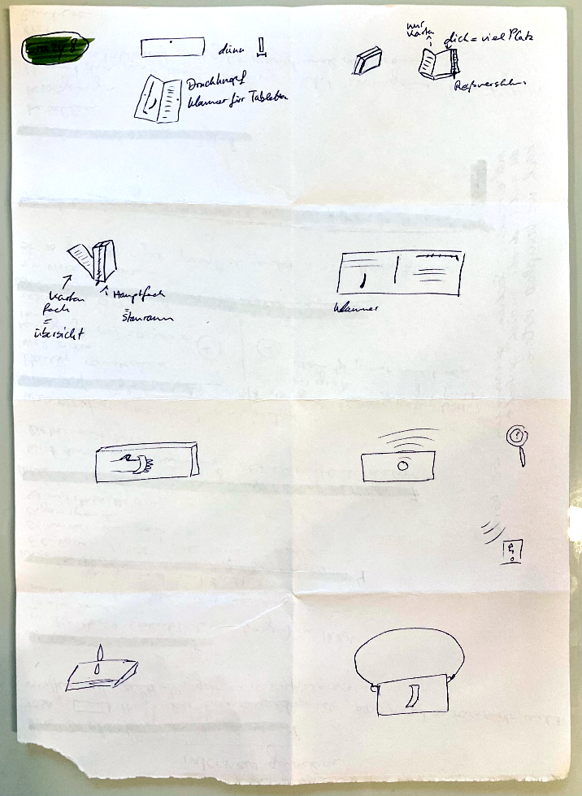
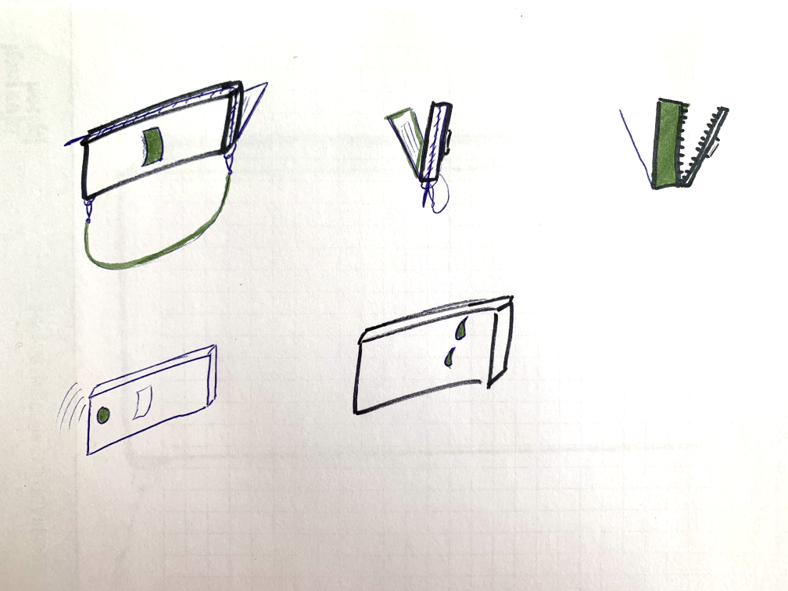
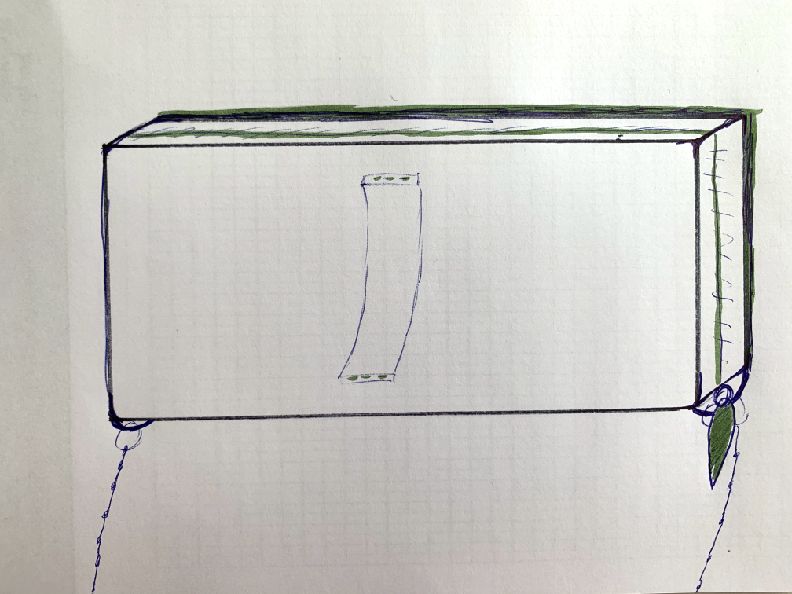
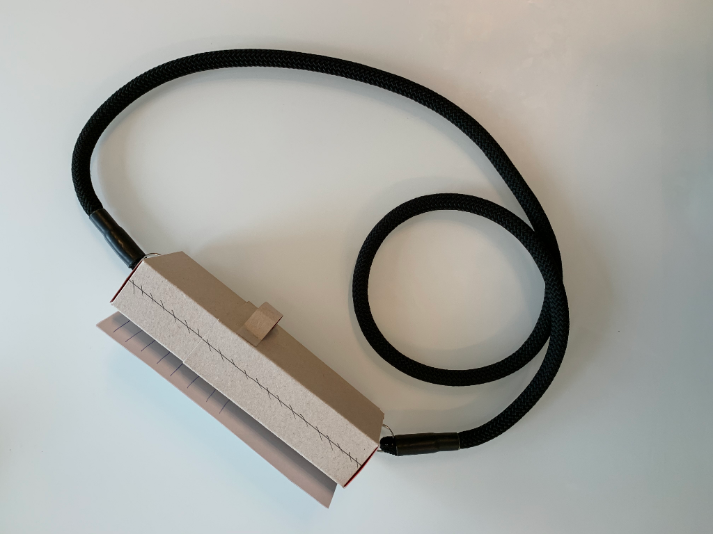
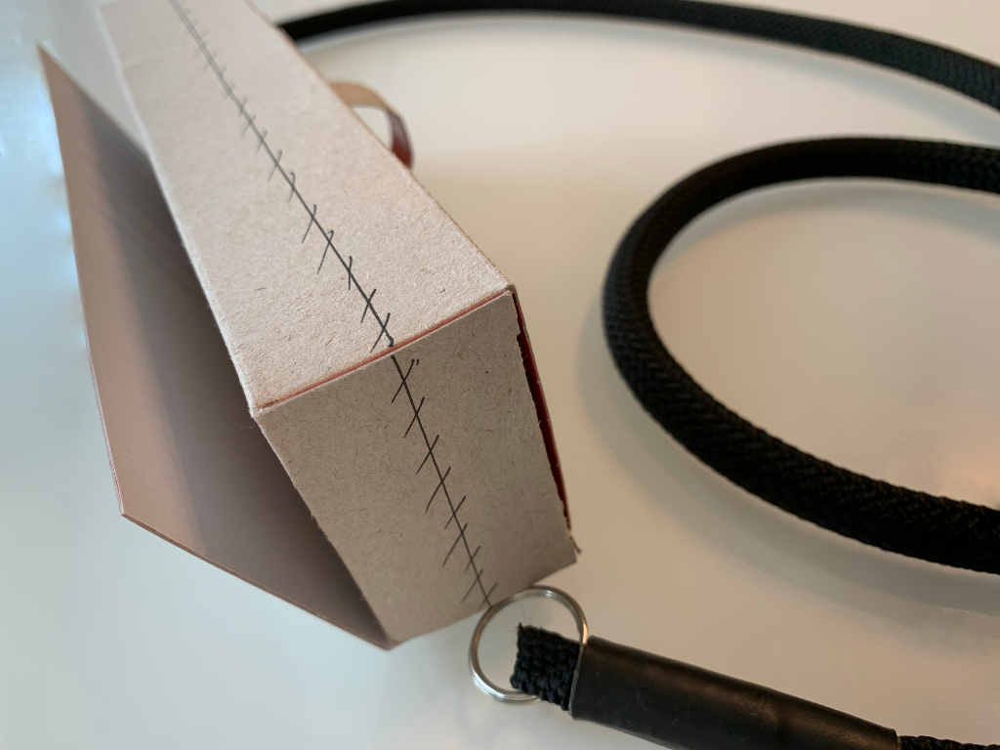
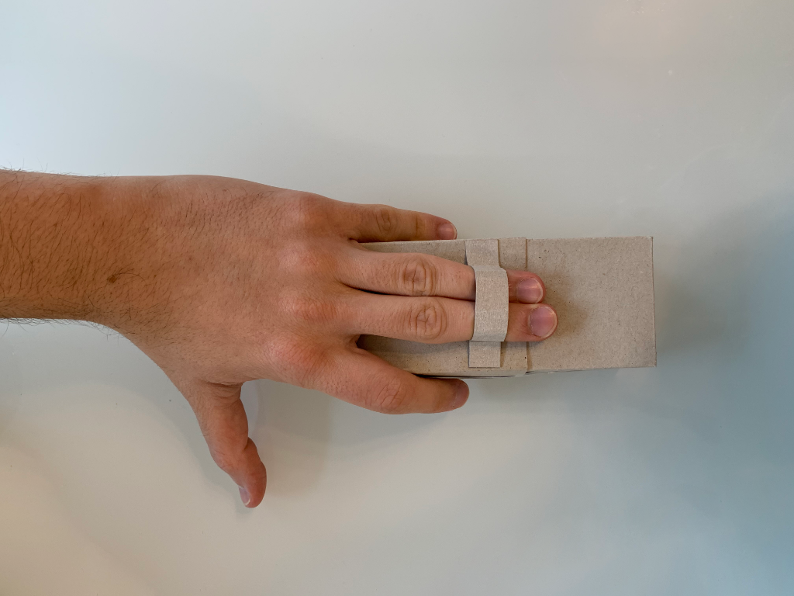
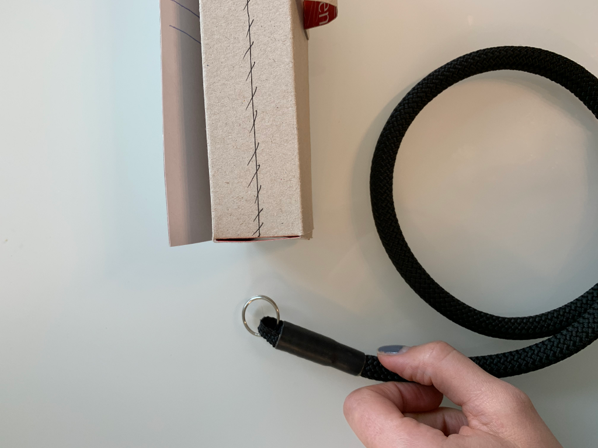

## The Wallet Project

The Wallet Project is a “quick wash” proposed by the d.school of Hasso Plattner’s Institute of Design at Standford to practise each phase of the Design Thinking approach.

  

### 1. Empathize

I collaborated with Luna during this Design Thinking circle. 

These are my meaningful questions to understand her thoughts while interacting with the actual wallet. 

* __Please describe at the beginning how your wallet looks and feels.__
    * It's pink, rectangle-shaped, a usual women's wallet, not that expensive, smooth material, easy to disinfect 
    
* What is the best and the worst thing about your wallet?
    * good: lots of storage space
    * to improve: the size is irrelevant since it does not fit in the trouser pocket
    * The smartphone doesn't fit into the wallet, even it is so big
    * Many coins in it
    
* What does your wallet contain?  (It's ok to give me some examples ☺️)
    * EC cards/ Visa Card
    * ID card
    * many other cards
    * Coupons
    * donation cards
    * Medicine
    
* Where is it stored?
    * Hold in Hand (does not like purses)
    * When she leaves the house: wallet, keys, cell phone are always with her
    
* Which payment methods do you use most?
    * rather with card

* When do you use the wallet?
    * To pay
    * for shopping
    * always takes it with her, never goes out without it
    * At a doctor's appointments
    * To the library

* Have you ever lost your wallet?
    * Only for a few minutes, because I forgot it in an IKEA, but I got it back quickly ✨

### 2. Define

__Top Findings__

1. Big, not expensive, smooth, disinfectable
2. Always full, also coins are contained
3. Size: Doesn't matter, it does not fit in the trouser pocket
4. Should be carryable without a bag
5. Because of point four, a tracking system or something like that could be useful
6. Needs much space for all of her stuff
7. The smartphone should fit into it

### 3. Ideate

Used method is the Crazy 8

### 4. Prototype

The Prototype contains a combination of several ideas coming from the Crazy 8.

### 5. Test
The suggestions for the perfect wallet were completely accepted, so I decided to design the prototype according to these specifications. I chose Tyvek for the material because it contains all the positive features I have planned for my wallet. It is tear- and splash-proof, super thin and light. The material Tyvek is mainly known from the company Paprcuts. Another idea would be to add a tracker to be able to find the wallet when needed. This could be solved with the help of Bluetooth, for example. This would make it possible to see the last place where the last connection was made.

### 6. Prototype Iteration

The final prototype consists of two compartments: a very thin card compartment, which contains space for several cards. And a spacious zippered section to store many smaller things. Furthermore, a hand strap is attached to the side. There the hand can be put through to carry the wallet like a handbag. If desired a chain can be attached as a shoulder strap. Thus the user becomes more mobile and the wallet is never lost. The large section contains a lot of space so that the cell phone can also be inserted.

